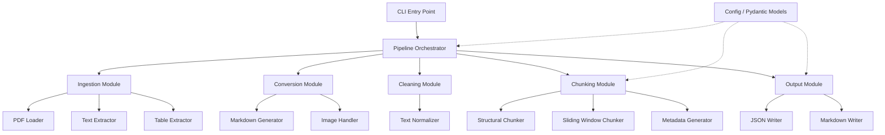
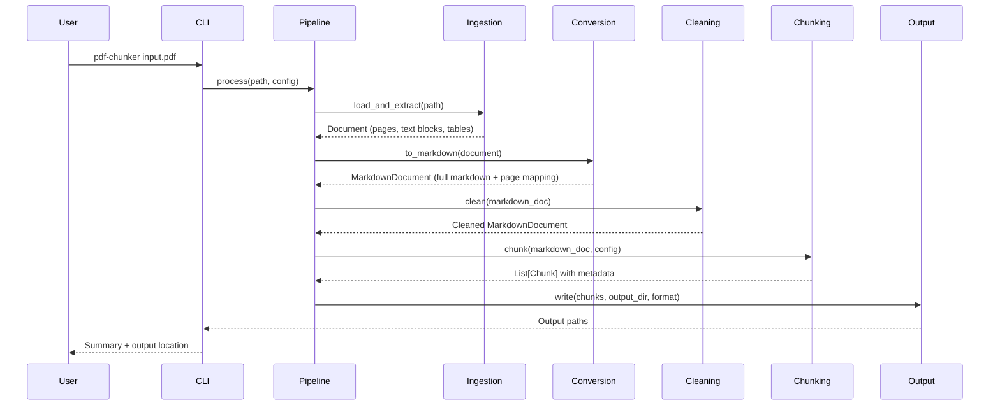
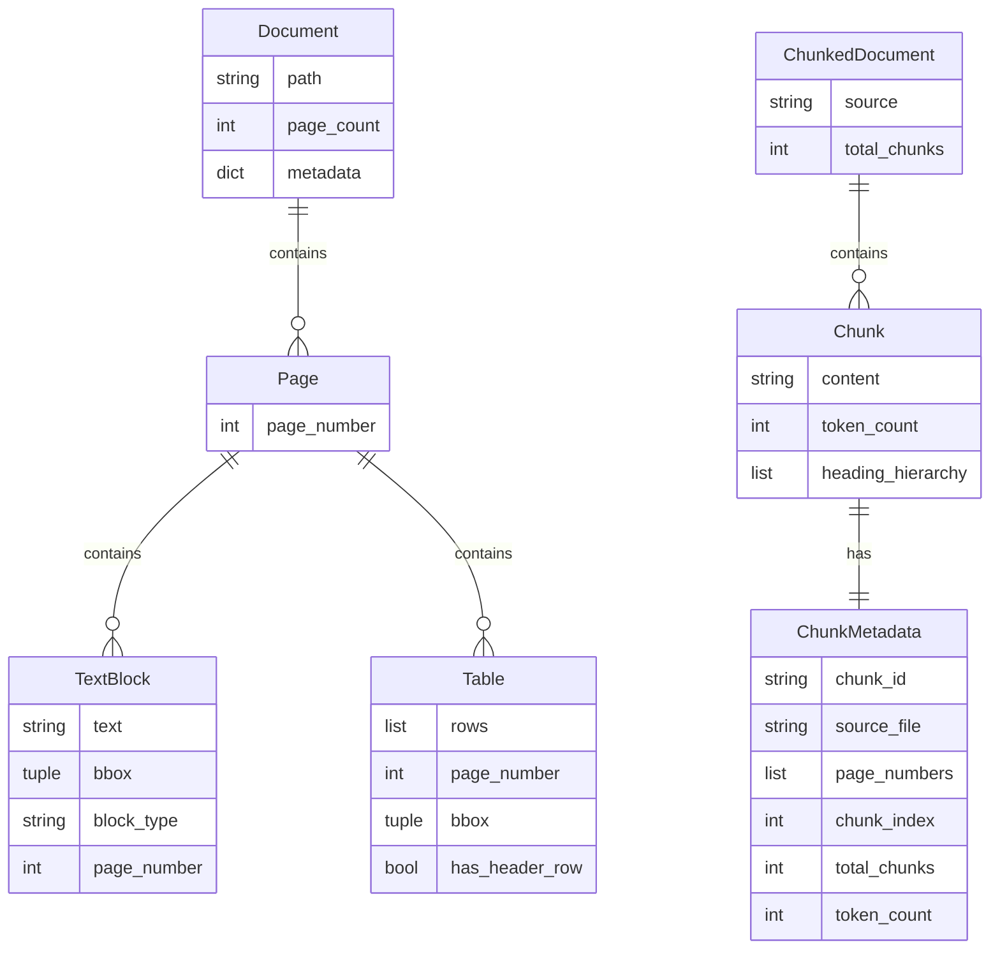
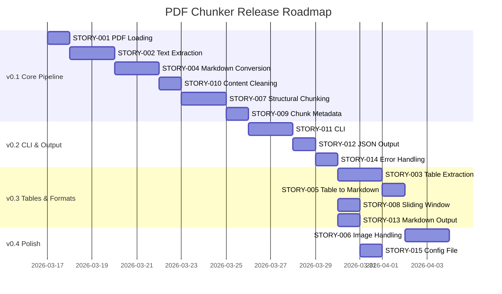

# PDF Chunker — Project Plan

> Generated: 2026-03-17
> Stack: Python 3.12+, CLI (Click), PyMuPDF (fitz), pdfplumber, Pydantic, pytest
> Approach: AI-Assisted Development

**Assumptions:**
- This is a CLI-first tool (no web UI initially). A Python package that can also be used as a library.
- Target output formats: Markdown optimized for LLM context windows (Claude, GPT, etc.).
- Chunking strategy focuses on semantic/structural chunking (by headings, sections, pages) rather than naive character-count splitting.
- No vector database or embedding generation in scope — this tool prepares content *before* it reaches a RAG pipeline or knowledge base.
- Output includes metadata (source file, page numbers, section hierarchy) to support downstream traceability.

---

## Table of Contents

1. [Requirements & Backlog](#requirements--backlog)
2. [Kanban Board Design](#kanban-board-design)
3. [System Architecture](#system-architecture)
4. [Technical Design Specifications](#technical-design-specifications)
5. [Release Roadmap](#release-roadmap)
6. [Definition of Ready](#definition-of-ready)
7. [Definition of Done](#definition-of-done)
8. [Risk Register](#risk-register)
9. [ADR Log](#adr-log)

---

## Requirements & Backlog

### Epics

| Epic | Description | Stories |
|------|-------------|---------|
| E1: PDF Ingestion | Reliably load and parse PDF files of varying complexity | STORY-001, STORY-002, STORY-003 |
| E2: Markdown Conversion | Convert parsed PDF content into clean, structured Markdown | STORY-004, STORY-005, STORY-006 |
| E3: Chunking & Optimization | Split Markdown into AI-optimized chunks with metadata | STORY-007, STORY-008, STORY-009, STORY-010 |
| E4: CLI & Output | Command-line interface and output format options | STORY-011, STORY-012, STORY-013 |
| E5: Quality & Robustness | Handling edge cases, logging, and error recovery | STORY-014, STORY-015 |

### Product Backlog

Ordered by priority (highest value, lowest dependency first). Pull from the top.

---

#### Epic: E1 — PDF Ingestion

**[STORY-001] Single PDF file loading**
*As a developer, I want to load a single PDF file from a local path so that I can begin processing it.*

- **Priority**: Must Have
- **Effort**: Small
- **Depends on**: None
- **Acceptance Criteria**:
  - [ ] Given a valid PDF path, the system loads the file and returns a document object
  - [ ] Given an invalid path, the system raises a clear `FileNotFoundError` with the attempted path
  - [ ] Given a non-PDF file, the system raises a `ValueError` indicating the file is not a valid PDF
  - [ ] The document object exposes page count and basic metadata (title, author if available)
- **AI Coding Notes**:
  - Create `src/pdf_chunker/ingestion/loader.py`
  - Use `pymupdf` (imported as `fitz`) for PDF loading — it's faster than pdfplumber for basic operations
  - Define a `Document` Pydantic model in `src/pdf_chunker/models.py` with fields: `path`, `page_count`, `metadata`, `pages`
  - Follows ADR-001 (PyMuPDF as primary PDF engine)

---

**[STORY-002] PDF text extraction with layout preservation**
*As a developer, I want to extract text from each page of a PDF while preserving reading order and basic structure so that downstream conversion produces accurate Markdown.*

- **Priority**: Must Have
- **Effort**: Medium
- **Depends on**: STORY-001
- **Acceptance Criteria**:
  - [ ] Text is extracted from every page in correct reading order
  - [ ] Paragraphs are preserved as distinct blocks (not merged into a single string)
  - [ ] Multi-column layouts are detected and columns are read in the correct order
  - [ ] Headers/footers that repeat across pages are identified and flagged
  - [ ] The extracted content for each page is stored as a list of `TextBlock` objects with bounding box info
- **Slicing Hints**:
  Slice 1: Extract raw text blocks with bounding boxes from a single-column PDF. Slice 2: Add reading-order sorting for multi-column layouts. Slice 3: Detect and flag repeating headers/footers.
- **AI Coding Notes**:
  - Create `src/pdf_chunker/ingestion/extractor.py`
  - Use `fitz.Page.get_text("dict")` to get block-level text with position data
  - Define `TextBlock` model in `models.py`: `text`, `bbox` (x0, y0, x1, y1), `block_type` (paragraph, heading, list_item, etc.), `page_number`
  - For multi-column detection: sort blocks by x-coordinate clusters, then by y within each cluster
  - Header/footer detection: compare text blocks at top/bottom of consecutive pages for repeated content

---

**[STORY-003] Table extraction from PDFs**
*As a developer, I want to extract tables from PDF pages so that tabular data is preserved in the final Markdown output.*

- **Priority**: Should Have
- **Effort**: Medium
- **Depends on**: STORY-001
- **Acceptance Criteria**:
  - [ ] Tables are detected on pages that contain them
  - [ ] Cell contents are extracted with correct row/column associations
  - [ ] Tables with merged cells are handled gracefully (merged cells span appropriately)
  - [ ] Each extracted table includes its page number and position on the page
  - [ ] Pages with no tables return an empty table list (no false positives)
- **Slicing Hints**:
  Slice 1: Detect and extract simple grid tables (no merged cells). Slice 2: Handle merged cells and spanning. Slice 3: Improve detection accuracy for borderless tables.
- **AI Coding Notes**:
  - Create `src/pdf_chunker/ingestion/table_extractor.py`
  - Use `pdfplumber` for table extraction — it significantly outperforms PyMuPDF for tables
  - Define `Table` model in `models.py`: `rows` (list of list of strings), `page_number`, `bbox`, `has_header_row`
  - `pdfplumber.Page.extract_tables()` returns list of tables as nested lists
  - Follows ADR-002 (pdfplumber for table extraction)

---

#### Epic: E2 — Markdown Conversion

**[STORY-004] Basic text-to-Markdown conversion**
*As a developer, I want to convert extracted text blocks into well-formatted Markdown so that the content is readable and structured.*

- **Priority**: Must Have
- **Effort**: Medium
- **Depends on**: STORY-002
- **Acceptance Criteria**:
  - [ ] Paragraphs are separated by blank lines
  - [ ] Detected headings are converted to appropriate Markdown heading levels (`#`, `##`, etc.)
  - [ ] Bold and italic formatting is preserved where detectable from the PDF font metadata
  - [ ] Bullet and numbered lists are converted to Markdown list syntax
  - [ ] Output is valid Markdown that renders correctly in any standard Markdown viewer
- **Slicing Hints**:
  Slice 1: Convert paragraphs and headings only (font-size based heading detection). Slice 2: Add bold/italic from font metadata. Slice 3: Detect and convert lists.
- **AI Coding Notes**:
  - Create `src/pdf_chunker/conversion/markdown_writer.py`
  - Heading detection heuristic: compare font size of each block to the document's body font size. Blocks with font size >1.2x body size are likely headings. Larger ratio = higher heading level.
  - Use `fitz` span-level font info (`flags` field) to detect bold (bit 4) and italic (bit 1)
  - List detection: look for blocks starting with `•`, `–`, `-`, or `\d+\.` patterns
  - Follows ADR-003 (heuristic-based structure detection)

---

**[STORY-005] Table-to-Markdown conversion**
*As a developer, I want to convert extracted tables into Markdown table syntax so that tabular data is preserved in the output.*

- **Priority**: Should Have
- **Effort**: Small
- **Depends on**: STORY-003
- **Acceptance Criteria**:
  - [ ] Tables are rendered using GitHub-Flavored Markdown pipe table syntax
  - [ ] The first row is treated as a header row when `has_header_row` is true
  - [ ] Cell contents containing pipe characters are escaped
  - [ ] Empty cells render correctly
  - [ ] Tables are inserted at the correct position relative to surrounding text
- **AI Coding Notes**:
  - Add `table_to_markdown()` function in `src/pdf_chunker/conversion/markdown_writer.py`
  - GFM table format: `| col1 | col2 |` with `|---|---|` separator after header
  - Escape `|` chars in cell content with `\|`
  - Position tables in output by comparing table bbox with surrounding text block bboxes

---

**[STORY-006] Image and figure handling**
*As a developer, I want to handle images and figures in PDFs so that they are either extracted or noted as placeholders in the Markdown output.*

- **Priority**: Could Have
- **Effort**: Medium
- **Depends on**: STORY-002
- **Acceptance Criteria**:
  - [ ] Images are extracted from the PDF and saved to an output directory
  - [ ] Markdown output includes image references (``) at the correct position
  - [ ] Figure captions, when detected adjacent to images, are included as alt text
  - [ ] When image extraction is disabled (via flag), a placeholder `[Image on page N]` is inserted instead
  - [ ] Extracted images use a deterministic naming scheme: `{doc_stem}_p{page}_img{index}.{ext}`
- **Slicing Hints**:
  Slice 1: Detect images and insert placeholders. Slice 2: Extract images and write to disk with references. Slice 3: Caption detection and alt text.
- **AI Coding Notes**:
  - Create `src/pdf_chunker/conversion/image_handler.py`
  - Use `fitz.Page.get_images()` to list images, `fitz.Pixmap` to extract
  - For caption detection: look for text blocks immediately below image bbox with italic or smaller font
  - Image output directory: `{output_dir}/images/`

---

#### Epic: E3 — Chunking & Optimization

**[STORY-007] Structural chunking by sections**
*As a developer, I want to split Markdown documents into chunks based on document structure (headings/sections) so that each chunk is a semantically coherent unit.*

- **Priority**: Must Have
- **Effort**: Medium
- **Depends on**: STORY-004
- **Acceptance Criteria**:
  - [ ] Document is split at heading boundaries (configurable heading level: default `##`)
  - [ ] Each chunk includes its heading hierarchy as context (e.g., a `###` chunk includes the parent `##` and `#` headings)
  - [ ] Chunks that exceed a configurable max token count are further split at paragraph boundaries
  - [ ] Chunks that are below a configurable min token count are merged with adjacent chunks
  - [ ] Empty sections (heading with no body content) are merged with the next section
- **Slicing Hints**:
  Slice 1: Split at heading boundaries with hierarchy context. Slice 2: Add max-token splitting at paragraph boundaries. Slice 3: Add min-token merging and empty section handling.
- **AI Coding Notes**:
  - Create `src/pdf_chunker/chunking/structural_chunker.py`
  - Define `Chunk` model in `models.py`: `content` (markdown string), `metadata` (see STORY-009), `token_count`, `heading_hierarchy` (list of strings)
  - Token counting: use `tiktoken` with `cl100k_base` encoding (used by Claude and GPT-4) — see ADR-004
  - Default config: `max_tokens=1500`, `min_tokens=100`, `split_heading_level=2`
  - Define chunking config as a `ChunkingConfig` Pydantic model in `src/pdf_chunker/config.py`

---

**[STORY-008] Sliding-window chunking with overlap**
*As a developer, I want an alternative chunking strategy that uses a sliding window with configurable overlap so that I can handle documents without clear heading structure.*

- **Priority**: Should Have
- **Effort**: Small
- **Depends on**: STORY-004
- **Acceptance Criteria**:
  - [ ] Document is split into chunks of a configurable token size (default 1000)
  - [ ] Consecutive chunks overlap by a configurable number of tokens (default 200)
  - [ ] Chunk boundaries prefer paragraph breaks over mid-sentence splits
  - [ ] Each chunk includes an overlap indicator noting how many tokens overlap with the previous/next chunk
- **AI Coding Notes**:
  - Create `src/pdf_chunker/chunking/window_chunker.py`
  - Implement a `SlidingWindowChunker` class with `chunk_size` and `overlap` params
  - Paragraph-boundary preference: when the window endpoint falls mid-paragraph, extend or contract to the nearest paragraph break (within 10% tolerance)
  - Both chunkers should implement a common `Chunker` protocol/ABC defined in `src/pdf_chunker/chunking/base.py`

---

**[STORY-009] Chunk metadata generation**
*As a developer, I want each chunk to carry rich metadata so that downstream AI applications can trace content back to its source and apply filters.*

- **Priority**: Must Have
- **Effort**: Small
- **Depends on**: STORY-007
- **Acceptance Criteria**:
  - [ ] Each chunk includes: `source_file` (original PDF path), `page_numbers` (list of pages the chunk spans), `chunk_index` (position in document), `total_chunks`, `heading_hierarchy`, `token_count`
  - [ ] Metadata includes a deterministic `chunk_id` (hash of source_file + chunk_index) for deduplication
  - [ ] Metadata is serializable to JSON
  - [ ] Metadata is accessible both as a Pydantic model and as a plain dict
- **AI Coding Notes**:
  - Define `ChunkMetadata` model in `src/pdf_chunker/models.py`
  - `chunk_id`: use `hashlib.sha256(f"{source_file}:{chunk_index}".encode()).hexdigest()[:16]`
  - Page number tracking: during chunking, track which page each text block originated from (requires page_number from `TextBlock` to flow through conversion)

---

**[STORY-010] Content cleaning and normalization**
*As a developer, I want chunk content to be cleaned and normalized so that AI applications receive high-quality, consistent input.*

- **Priority**: Must Have
- **Effort**: Small
- **Depends on**: STORY-004
- **Acceptance Criteria**:
  - [ ] Excessive whitespace (3+ consecutive newlines) is collapsed to double newlines
  - [ ] Unicode characters are normalized (smart quotes → straight quotes, em-dashes → --, etc.)
  - [ ] Hyphenated line breaks (words split across lines with `-`) are rejoined
  - [ ] Page numbers, headers, and footers (identified in STORY-002) are removed from content
  - [ ] Ligatures (fi, fl, ff, ffi, ffl) are expanded to their component characters
- **AI Coding Notes**:
  - Create `src/pdf_chunker/conversion/cleaner.py`
  - Apply cleaning before chunking (in the conversion pipeline, after markdown generation)
  - Use `unicodedata.normalize("NFKC", text)` as a baseline, then apply specific replacements
  - Hyphen rejoining regex: `r'(\w+)-\s*\n\s*(\w+)'` → `r'\1\2'`
  - Run cleaning as a pipeline of small, composable functions for testability

---

#### Epic: E4 — CLI & Output

**[STORY-011] CLI with file and directory input**
*As a user, I want to run pdf-chunker from the command line with a file or directory path so that I can process PDFs without writing code.*

- **Priority**: Must Have
- **Effort**: Medium
- **Depends on**: STORY-007, STORY-010
- **Acceptance Criteria**:
  - [ ] `pdf-chunker <path>` processes a single PDF file
  - [ ] `pdf-chunker <directory>` processes all PDFs in the directory (non-recursive by default)
  - [ ] `--recursive` flag enables recursive directory traversal
  - [ ] `--output <dir>` specifies the output directory (default: `./output/`)
  - [ ] Progress is displayed for multi-file processing (file N of M)
  - [ ] Exit code 0 on success, 1 on partial failure (some files failed), 2 on total failure
- **Slicing Hints**:
  Slice 1: Single file processing with default output. Slice 2: Directory processing with progress. Slice 3: Recursive flag and exit codes.
- **AI Coding Notes**:
  - Create `src/pdf_chunker/cli.py` using Click
  - Entry point in `pyproject.toml`: `[project.scripts] pdf-chunker = "pdf_chunker.cli:main"`
  - Use `click.progressbar()` or `rich.progress` for progress display
  - Create the main pipeline orchestrator in `src/pdf_chunker/pipeline.py` that wires together ingestion → conversion → cleaning → chunking → output
  - Follows ADR-005 (Click for CLI)

---

**[STORY-012] JSON output format**
*As a developer, I want to output chunks as a JSON file so that downstream applications can easily ingest the structured data.*

- **Priority**: Must Have
- **Effort**: Small
- **Depends on**: STORY-009, STORY-011
- **Acceptance Criteria**:
  - [ ] Default output is a single JSON file per input PDF: `{output_dir}/{doc_stem}_chunks.json`
  - [ ] JSON structure: `{ "source": "...", "total_chunks": N, "chunks": [ { "chunk_id": "...", "content": "...", "metadata": {...} } ] }`
  - [ ] Output is pretty-printed by default, `--compact` flag produces minified JSON
  - [ ] JSON is valid and parseable by standard JSON parsers
- **AI Coding Notes**:
  - Create `src/pdf_chunker/output/json_writer.py`
  - Use Pydantic's `.model_dump(mode="json")` for serialization
  - Define `ChunkedDocument` model in `models.py`: `source`, `total_chunks`, `chunks` (list of `Chunk`)

---

**[STORY-013] Markdown output format**
*As a developer, I want to output chunks as individual Markdown files so that I can review and manually curate chunks before ingestion.*

- **Priority**: Should Have
- **Effort**: Small
- **Depends on**: STORY-009, STORY-011
- **Acceptance Criteria**:
  - [ ] `--format markdown` outputs one `.md` file per chunk: `{output_dir}/{doc_stem}/chunk_{index:04d}.md`
  - [ ] Each file includes YAML frontmatter with the chunk metadata
  - [ ] A manifest file `{output_dir}/{doc_stem}/manifest.json` lists all chunk files with their metadata
  - [ ] Full-document Markdown (pre-chunking) is also saved as `{output_dir}/{doc_stem}/full.md`
- **AI Coding Notes**:
  - Create `src/pdf_chunker/output/markdown_writer.py`
  - YAML frontmatter format: `---\nchunk_id: ...\nsource: ...\npages: [1, 2]\n---\n`
  - Use `PyYAML` for frontmatter serialization
  - Both output writers should implement a common `OutputWriter` protocol in `src/pdf_chunker/output/base.py`

---

#### Epic: E5 — Quality & Robustness

**[STORY-014] Comprehensive error handling and logging**
*As a developer, I want clear error messages and logging so that I can diagnose issues when processing fails.*

- **Priority**: Must Have
- **Effort**: Small
- **Depends on**: STORY-011
- **Acceptance Criteria**:
  - [ ] All errors include the source file path and page number (when applicable)
  - [ ] `--verbose` flag enables DEBUG-level logging to stderr
  - [ ] Default logging level is WARNING
  - [ ] Corrupted or password-protected PDFs produce a clear error message and are skipped (not crash)
  - [ ] A summary is printed at the end: `Processed N files, M chunks generated, K errors`
- **AI Coding Notes**:
  - Use Python's `logging` module with a configured formatter
  - Create logger per module: `logger = logging.getLogger(__name__)`
  - Configure logging in `cli.py` based on `--verbose` flag
  - Password-protected PDF detection: `fitz.open()` raises with specific error — catch and report

---

**[STORY-015] Configuration file support**
*As a user, I want to specify processing options in a config file so that I don't need to pass many CLI flags for repeated use.*

- **Priority**: Could Have
- **Effort**: Small
- **Depends on**: STORY-011
- **Acceptance Criteria**:
  - [ ] `--config <path>` loads settings from a TOML file
  - [ ] Config file supports all CLI options (chunking strategy, token limits, output format, etc.)
  - [ ] CLI flags override config file values
  - [ ] `pdf-chunker init-config` generates a default config file with comments
  - [ ] Config is validated at load time with clear error messages for invalid values
- **AI Coding Notes**:
  - Use Python 3.11+ `tomllib` (stdlib) for TOML parsing
  - Create `src/pdf_chunker/config.py` (extend the existing `ChunkingConfig` to a full `AppConfig`)
  - Merge priority: CLI args > config file > defaults
  - Use Pydantic for config validation

---

## Kanban Board Design

### Column Structure

| Column | Purpose | WIP Limit |
|--------|---------|-----------|
| Backlog | All planned stories, ordered by priority | Unlimited |
| Ready | Stories meeting Definition of Ready, queued to pull | 5 |
| In Progress | Actively being implemented | 1 |
| Review | Implementation complete, verifying acceptance criteria | 2 |
| Done | Meets Definition of Done | Unlimited |

### Flow Guidance

- Always pull from the top of the Backlog into Ready
- A story enters In Progress only when it meets the Definition of Ready
- A story moves to Done only when it meets the Definition of Done
- If a story is blocked, note the blocker and pull the next Ready item
- Solo developer workflow: Review column is for self-review and running the full test suite

---

## System Architecture

### Overview

PDF Chunker is a Python CLI tool with a pipeline architecture. A PDF file flows through four stages: **Ingestion** (parse PDF to structured data) → **Conversion** (structured data to Markdown) → **Cleaning** (normalize and clean content) → **Chunking** (split into AI-optimized chunks with metadata) → **Output** (write to JSON or Markdown files).

### Component Diagram



### Data Flow



### Service Boundaries

This is a single-process CLI application. No microservices or separate deployments. All modules are Python packages within a single installable package. The pipeline orchestrator is the central coordinator — modules do not import each other directly (they communicate via the data models).

### API Design

This is a library + CLI, not a web service. The public Python API is:

```python
# High-level
from pdf_chunker import process_pdf
chunks = process_pdf("input.pdf", output_dir="./output", config=ChunkingConfig())

# Low-level
from pdf_chunker.ingestion import load_document, extract_text, extract_tables
from pdf_chunker.conversion import to_markdown
from pdf_chunker.chunking import chunk_structural, chunk_sliding_window
```

### Data Model



### Infrastructure

- **Distribution**: PyPI package (installable via `pip install pdf-chunker`)
- **CI**: GitHub Actions — lint, test, type-check on every push
- **Python**: 3.12+ (uses `tomllib` from stdlib)
- **No cloud infrastructure** — this is a local CLI tool

### AI Coding Notes

When starting a coding session, always load the pipeline architecture context: data flows from Ingestion → Conversion → Cleaning → Chunking → Output. Modules communicate through Pydantic models defined in `models.py`. The pipeline orchestrator (`pipeline.py`) wires everything together. Never import between peer modules (e.g., chunking should not import from ingestion).

---

## Technical Design Specifications

### E1: PDF Ingestion

**End-to-End Behaviour**: When a user points pdf-chunker at a PDF file, the ingestion module opens the file, iterates through each page, and extracts both text blocks (with position, font, and reading-order data) and tables (with row/column structure). The result is a `Document` object containing a list of `Page` objects, each with its `TextBlock`s and `Table`s. This structured representation is the input to the conversion stage.

**Key Contracts**:
- `load_document(path: str | Path) -> Document` — opens PDF, returns Document with metadata and empty pages
- `extract_text(document: Document) -> Document` — populates each page's text_blocks
- `extract_tables(document: Document) -> Document` — populates each page's tables
- `TextBlock(text: str, bbox: tuple[float, float, float, float], block_type: str, page_number: int, font_size: float, font_flags: int)`
- `Table(rows: list[list[str]], page_number: int, bbox: tuple[float, float, float, float], has_header_row: bool)`

**Acceptance Test Guidance**:
- STORY-001 test: load a known test PDF (`tests/fixtures/simple.pdf`), assert page_count matches expected, assert metadata fields are populated.
- STORY-002 test: load a two-column PDF (`tests/fixtures/two_column.pdf`), assert text blocks are in correct reading order (left column before right column). Load a multi-page PDF, assert repeated headers are flagged.
- STORY-003 test: load a PDF with a known table (`tests/fixtures/table.pdf`), assert extracted table row/column counts match expected, assert cell contents match.

**Edge Cases**:
- Scanned PDFs (image-only, no text layer): detect and warn — return empty text blocks with a warning, don't crash. OCR is out of scope for v1.
- PDFs with embedded fonts that don't map to Unicode: use PyMuPDF's built-in text extraction which handles most encoding issues.
- Very large PDFs (1000+ pages): process page-by-page without loading all pages into memory simultaneously.

**Error Handling**:
- Password-protected PDFs: catch `fitz.FileDataError`, raise `PDFAccessError(path, "PDF is password-protected")`.
- Corrupted PDFs: catch `fitz.FileDataError`, raise `PDFParseError(path, "PDF file is corrupted or unreadable")`.
- Custom exceptions defined in `src/pdf_chunker/exceptions.py`.

**Testing Approach**:
- Unit tests for text block sorting/ordering logic (no PDF needed — test with mock block data).
- Integration tests using fixture PDFs for full extraction pipeline.
- Test fixtures: create minimal PDFs programmatically using `fpdf2` in a `tests/conftest.py` fixture, or commit small static PDFs to `tests/fixtures/`.

---

### E2: Markdown Conversion

**End-to-End Behaviour**: The conversion module takes a `Document` (with populated text blocks and tables) and produces a `MarkdownDocument` — a single Markdown string plus a mapping from character offsets to source page numbers. Headings are detected by font size, formatting by font flags, lists by text patterns. Tables are converted to GFM pipe tables and inserted at the correct position relative to surrounding text.

**Key Contracts**:
- `to_markdown(document: Document) -> MarkdownDocument`
- `MarkdownDocument(content: str, page_map: list[tuple[int, int, int]])` — page_map maps character ranges to page numbers: `[(start_offset, end_offset, page_number), ...]`
- `table_to_markdown(table: Table) -> str`

**Acceptance Test Guidance**:
- STORY-004 test: provide a Document with text blocks of varying font sizes. Assert output contains `# ` for the largest, `## ` for the next largest. Assert paragraphs are separated by blank lines. Assert bold/italic text is wrapped in `**`/`*`.
- STORY-005 test: provide a Document with a known table. Assert output contains valid GFM pipe table syntax. Assert pipe characters in cell content are escaped.
- STORY-006 test: provide a Document with an image. Assert output contains `` reference or `[Image on page N]` placeholder depending on config.

**Edge Cases**:
- Documents with no detectable headings (all same font size): treat entire content as body text, don't generate spurious headings.
- Extremely long tables (100+ rows): convert normally but add a note in metadata that the table is large.
- Code blocks in PDFs (monospace font): detect monospace font and wrap in triple-backtick code fences.

**Error Handling**:
- If font metadata is missing (rare but possible), fall back to treating all text as body paragraphs and log a warning.

**Testing Approach**:
- Unit tests: construct TextBlock and Table objects directly (no PDF parsing) and test conversion functions in isolation.
- Snapshot tests: for a few fixture PDFs, store expected Markdown output and assert conversion matches (with tolerance for whitespace differences).

---

### E3: Chunking & Optimization

**End-to-End Behaviour**: After conversion and cleaning, the chunking module takes a `MarkdownDocument` and splits it into a list of `Chunk` objects, each carrying its content and metadata. The structural chunker splits at heading boundaries and respects token limits. The sliding-window chunker provides a simpler alternative for unstructured documents. Both strategies produce chunks with metadata that traces back to the source PDF.

**Key Contracts**:
- `Chunker` protocol: `chunk(document: MarkdownDocument, config: ChunkingConfig) -> list[Chunk]`
- `StructuralChunker` implements `Chunker`
- `SlidingWindowChunker` implements `Chunker`
- `ChunkingConfig(strategy: str = "structural", max_tokens: int = 1500, min_tokens: int = 100, overlap: int = 200, split_heading_level: int = 2)`
- `Chunk(content: str, metadata: ChunkMetadata, token_count: int, heading_hierarchy: list[str])`
- `ChunkMetadata(chunk_id: str, source_file: str, page_numbers: list[int], chunk_index: int, total_chunks: int, token_count: int)`

**Acceptance Test Guidance**:
- STORY-007 test: provide a MarkdownDocument with 3 `##` sections. Assert 3 chunks are produced. Assert each chunk's `heading_hierarchy` includes the parent `#` heading. Provide a document with one very long section — assert it's split at paragraph boundaries and both sub-chunks include the heading context.
- STORY-008 test: provide a MarkdownDocument with 2000 tokens. With chunk_size=500, overlap=100, assert ~4-5 chunks. Assert consecutive chunks share ~100 tokens of overlapping content.
- STORY-009 test: process a known PDF end-to-end. Assert each chunk has a non-empty `chunk_id`, correct `source_file`, non-empty `page_numbers`, and sequential `chunk_index` values from 0 to total_chunks-1.
- STORY-010 test: provide text with `\u201c` (smart quotes), hyphenated line breaks, and triple newlines. Assert output has straight quotes, rejoined words, and double newlines.

**Edge Cases**:
- Documents with deeply nested headings (5+ levels): structural chunker should still split correctly; heading hierarchy depth is unlimited.
- Chunks that consist entirely of a table: keep the table intact in a single chunk even if it exceeds max_tokens (log a warning).
- Empty documents: return an empty chunk list, don't crash.

**Error Handling**:
- If tiktoken fails to load the encoding, fall back to a character-based estimate (1 token ≈ 4 characters) and log a warning.

**Testing Approach**:
- Unit tests for chunking logic using constructed MarkdownDocument objects (no PDF parsing).
- Unit tests for cleaner functions using raw strings.
- Property-based tests: for any document, assert that concatenating all chunks (minus overlap) reproduces the original content.
- Integration tests: end-to-end from fixture PDF to chunks.

---

### E4: CLI & Output

**End-to-End Behaviour**: The user invokes `pdf-chunker` from the terminal with a file or directory path. The CLI validates inputs, loads config, invokes the pipeline, and writes results to the output directory. For single-file processing, one output file is produced. For directory processing, one output file per input PDF is produced with a progress indicator. Results are written as JSON (default) or Markdown files.

**Key Contracts**:
- CLI: `pdf-chunker [OPTIONS] INPUT_PATH`
- Options: `--output DIR`, `--format [json|markdown]`, `--strategy [structural|sliding]`, `--max-tokens INT`, `--overlap INT`, `--recursive`, `--verbose`, `--compact`, `--config PATH`
- `Pipeline.process(input_path: Path, config: AppConfig) -> ProcessingResult`
- `ProcessingResult(output_paths: list[Path], total_chunks: int, errors: list[str])`
- JSON schema: `{ "source": str, "total_chunks": int, "processing_config": {...}, "chunks": [{ "chunk_id": str, "content": str, "metadata": {...} }] }`

**Acceptance Test Guidance**:
- STORY-011 test: invoke CLI with a test PDF path using Click's `CliRunner`. Assert exit code 0. Assert output file exists at expected path. Invoke with a directory — assert one output file per PDF.
- STORY-012 test: process a fixture PDF with JSON output. Parse the output file as JSON. Assert it contains the expected schema fields. Assert `total_chunks` matches the number of items in `chunks` array.
- STORY-013 test: process a fixture PDF with `--format markdown`. Assert output directory contains `chunk_0001.md`, `manifest.json`, and `full.md`. Assert frontmatter in chunk files is valid YAML.

**Edge Cases**:
- Output directory doesn't exist: create it automatically.
- Input path is neither a file nor a directory: exit with code 2 and clear error message.
- No PDFs found in directory: exit with code 0 and a message "No PDF files found in {path}".

**Error Handling**:
- CLI-level errors (bad arguments) are handled by Click with automatic help text.
- Processing errors are collected and reported in the summary, not raised as exceptions.
- Partial failures (some files succeed, some fail): exit code 1, print summary of successes and failures.

**Testing Approach**:
- CLI tests using Click's `CliRunner` for fast, in-process testing.
- Integration tests that run the full pipeline on fixture PDFs.
- Output format tests that validate JSON schema and Markdown frontmatter.

---

### E5: Quality & Robustness

**End-to-End Behaviour**: Error handling and logging are woven throughout the pipeline. When processing fails for a single file in a batch, the error is logged, the file is skipped, and processing continues. Verbose mode outputs detailed DEBUG logs. A config file allows users to codify their preferred settings.

**Key Contracts**:
- `AppConfig` Pydantic model: all CLI options plus config-file-only options
- `pdf-chunker init-config` subcommand outputs a commented TOML file
- Logging: Python stdlib `logging` with format `%(asctime)s %(levelname)s %(name)s: %(message)s`

**Acceptance Test Guidance**:
- STORY-014 test: process a corrupted PDF fixture. Assert it doesn't crash. Assert the error message includes the file path. Assert exit code is 1 (partial failure) when mixed with valid PDFs. Process with `--verbose` — assert DEBUG-level messages appear in captured stderr.
- STORY-015 test: create a TOML config file, invoke CLI with `--config`. Assert config values override defaults. Assert CLI flags override config file values.

**Edge Cases**:
- Config file with unknown keys: warn and ignore (don't crash).
- Config file with invalid values: raise a clear validation error at startup, before processing begins.

**Error Handling**:
- All custom exceptions inherit from a base `PDFChunkerError`.
- Pipeline catches all `PDFChunkerError` subtypes and logs them; unexpected exceptions propagate.

**Testing Approach**:
- Unit tests for config loading and validation.
- Integration tests for error recovery scenarios (corrupted PDFs, missing files).
- CLI tests for logging output and exit codes.

---

## Release Roadmap

| Release | Stories Included | Goal |
|---------|-----------------|------|
| v0.1 — Core Pipeline | STORY-001, STORY-002, STORY-004, STORY-010, STORY-007, STORY-009 | Single PDF → cleaned, structurally-chunked Markdown with metadata |
| v0.2 — CLI & JSON Output | STORY-011, STORY-012, STORY-014 | Usable CLI tool with JSON output and error handling |
| v0.3 — Tables & Formats | STORY-003, STORY-005, STORY-008, STORY-013 | Table support, sliding-window chunker, Markdown output format |
| v0.4 — Polish | STORY-006, STORY-015 | Image handling, config files, production readiness |

### Timeline



> Note: Kanban flow means these dates are estimates based on backlog order and AI-assisted development velocity. Adjust as actual throughput becomes clear.

---

## Definition of Ready

A story must meet ALL of the following before it can be pulled into In Progress:

- [ ] Story is written in "As a / I want / So that" format
- [ ] Acceptance criteria are defined and unambiguous
- [ ] Dependencies are identified and either resolved or in progress
- [ ] Any design questions or open unknowns are resolved
- [ ] Story is small enough to be implemented in a single focused AI-assisted coding session (if not, split it)
- [ ] AI Coding Notes are populated with file paths, libraries, constraints, and relevant ADR references

---

## Definition of Done

A story must meet ALL of the following before it moves to Done:

- [ ] All acceptance criteria are verified
- [ ] Every acceptance criterion maps to at least one passing test
- [ ] Code is implemented and committed
- [ ] Tests are written and passing (at the level defined in the Technical Design Spec for this Epic)
- [ ] No regressions introduced in existing functionality
- [ ] Any relevant documentation or ADRs are updated
- [ ] Code has been reviewed (self-review or AI review is acceptable for solo workflow)

---

## Risk Register

| ID | Risk | Likelihood | Impact | Mitigation |
|----|------|-----------|--------|-----------|
| R1 | PDF parsing quality varies wildly across document types | High | High | Use test fixtures covering diverse PDF types (scanned, multi-column, form-filled, academic). Add fixture PDFs incrementally as edge cases are discovered. |
| R2 | Heading detection heuristics produce incorrect structure | Medium | High | Make heading detection configurable (font-size threshold). Provide a `--no-headings` fallback that treats all text as body. Test with PDFs that have unusual font hierarchies. |
| R3 | Architectural drift from iterative AI-assisted coding | Medium | High | Refer back to Architecture and ADR sections at the start of each coding session. Enforce module boundaries via import linting. |
| R4 | Scope creep as AI coding lowers implementation friction | Medium | Medium | Keep backlog prioritized; resist adding stories mid-flow without explicit re-prioritization. |
| R5 | Token counting accuracy affects chunk sizing | Low | Medium | Use tiktoken for accurate counts. Add integration tests that verify chunk sizes are within configured bounds. |
| R6 | Large PDFs cause memory issues | Low | High | Process pages iteratively. Profile memory usage with a 500+ page PDF during v0.2 testing. |

---

## ADR Log

### ADR-001: PyMuPDF as Primary PDF Engine

- **Date**: 2026-03-17
- **Status**: Accepted
- **Context**: Need a fast, reliable Python library for PDF text extraction with layout information.
- **Options Considered**: PyMuPDF (fitz), pdfplumber, pdfminer.six, pypdf.
- **Decision**: Use PyMuPDF as the primary PDF engine for loading and text extraction.
- **Rationale**: PyMuPDF is significantly faster than alternatives (10-50x for large documents), provides rich text metadata (font size, flags, bounding boxes), and has excellent documentation. It handles most encoding edge cases internally.
- **Consequences**: C-extension dependency (compiled binary); may complicate deployment on some platforms. Acceptable for a CLI tool.

### ADR-002: pdfplumber for Table Extraction

- **Date**: 2026-03-17
- **Status**: Accepted
- **Context**: Table extraction requires specialized algorithms that differ from general text extraction.
- **Options Considered**: PyMuPDF table extraction, pdfplumber, camelot, tabula-py.
- **Decision**: Use pdfplumber specifically for table extraction, while using PyMuPDF for everything else.
- **Rationale**: pdfplumber has the best table detection accuracy for programmatic PDFs without requiring Java (unlike tabula) or complex native dependencies (unlike camelot). Using two libraries is acceptable since they serve distinct purposes.
- **Consequences**: Two PDF libraries as dependencies. Table extraction is slower than text extraction but tables are typically a small fraction of content.

### ADR-003: Heuristic-Based Structure Detection

- **Date**: 2026-03-17
- **Status**: Accepted
- **Context**: PDFs don't have semantic structure (headings, lists, etc.) — structure must be inferred from visual properties.
- **Options Considered**: Font-size heuristics, PDF tagged structure (if available), ML-based layout analysis, manual configuration.
- **Decision**: Use font-size and font-flag heuristics as the primary structure detection method.
- **Rationale**: Heuristics work well for the majority of programmatic PDFs (reports, papers, documentation). Tagged PDFs are rare. ML-based approaches add significant complexity and dependencies for marginal improvement on common document types. Heuristics are fast and predictable.
- **Consequences**: Will produce suboptimal results on PDFs with unusual font hierarchies. Mitigated by making thresholds configurable and providing a fallback mode.

### ADR-004: tiktoken for Token Counting

- **Date**: 2026-03-17
- **Status**: Accepted
- **Context**: AI-optimized chunking requires accurate token counts to respect model context windows.
- **Options Considered**: tiktoken (OpenAI), character-based estimation, word-based estimation, sentencepiece.
- **Decision**: Use tiktoken with the `cl100k_base` encoding.
- **Rationale**: `cl100k_base` is the tokenizer used by GPT-4 and is close enough to Claude's tokenizer for practical chunk sizing. tiktoken is fast (Rust backend) and easy to install. Exact token counts are more reliable than estimation for chunk boundary decisions.
- **Consequences**: Chunk sizes are approximate for non-OpenAI models, but close enough for practical use. Character-based fallback if tiktoken is unavailable.

### ADR-005: Click for CLI Framework

- **Date**: 2026-03-17
- **Status**: Accepted
- **Context**: Need a CLI framework for argument parsing, help text, and subcommands.
- **Options Considered**: Click, argparse (stdlib), typer, fire.
- **Decision**: Use Click.
- **Rationale**: Click provides excellent composability, built-in testing support (`CliRunner`), and good documentation. It's a mature, widely-used library. Typer is a thin wrapper over Click that adds type-hint magic but less control. argparse is verbose for complex CLIs.
- **Consequences**: One additional dependency. Click's decorator-based API is well-known and easy for AI coding assistants to generate correctly.
